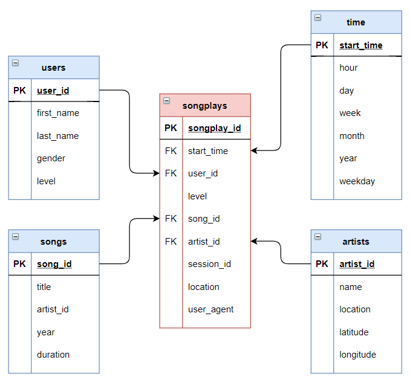

# Data Lake: S3 and Spark
Project completed as part of the Data Engineering Nanodegree Program

## Sparkify

**Sparkify:** Sparkify is a fictive company with a music streaming mobile application.

**Analytics Goals:** Sparkify wants to move their data warehouse to a data lake

**Initial Data:** Data collected by Sparkify are initially stored into two types of JSON files: 

1. The user activity on the app (will be refered as: *log_data*), which contains data specific to each user and his associated activities
2. Metadata on the songs in the app (will be refered as: *song_data*), which contains information about specific songs and artists

**Objectives:** The objective of this pipeline is to take the raw data from S3, transform the data into a star-schema (see graph below) using Apache Spark and put the data back into S3 (as a Data Lake) for the analytics team to perform their querries. 

## Data Warehouse Project

### Steps taken

**1. Create a spark session**
 
**2. Process the Songs files (JSON)**
	a. Load data from songs files (JSON) from S3
	b. Create the songs' table
	c. Create the Artists' table
	
**3. Process the Logs Data**
	a. Load data from the logs files (JSON) from S3
	b. Create the users's table
	c. Create the time's table
		- Transformed from Unix ms to Timestamp
	d. Create the fact table, i.e. songplays' table
		- Using SQL to merge data from the songs and from the logs.

### Files in this project

- *dl.cfg* - Contains confidential information to loggin into AWS and bucket (conceal)
- *etl.py* - This is the main file. When run, it takes the data from S3 (from Udacity Database), modifiy the data with pyspark (Apache Spark) into a star schema and saved them back into S3. 