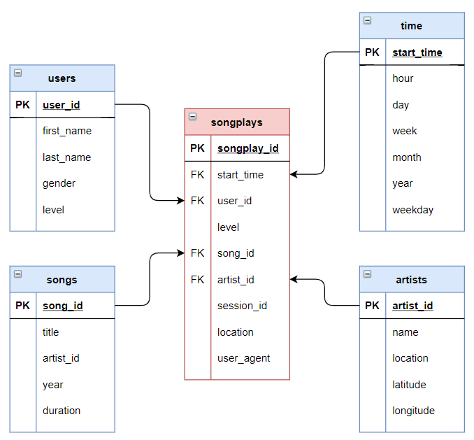

# Data Warehouse: S3 to Redshift
Project completed as part of the Data Engineering Nanodegree Program

## Sparkify

**Sparkify:** Sparkify is a fictive company with a music streaming mobile application.

**Analytics Goals:** Sparkify wants to move its processes and data onto the cloud. 

**Initial Data:** Data collected by Sparkify are initially stored into two types of JSON files: 

1. The user activity on the app (will be refered as: *log_data*), which contains data specific to each user and his associated activities
2. Metadata on the songs in the app (will be refered as: *song_data*), which contains information about specific songs and artists

**Objectives:** The objective is to take the raw data from its sources, transform them into a new star schema (see graph below) and store the new data in the cloud (in this case: redshift)

## Data Warehouse Project

### Steps taken

1. Create role and redshift cluster in AWS

2. Create tables in redshift
    
    a. Create staging tables to get the raw data into Redshift
    
    b. Create the final tables based on the new star schema

3. Copy data from S3 into staging table in Redshift

4. Copy only the needed data from our staging tables into our final tables

### Files in this project

*Notes: The followings files requires to have an AWS access, a roles allowing S3 reads and an active redshift bucket to run*

- *Create_tables.py* - this file can be run to create the stagings tables and final tables. it will drops existing tables if they exists
- *dwh.cfg* - Contains confidential information to loggin into AWS and bucket (conceal)
- *etl.py* - This is the main file. When run, it takes the data from S3 (from Udacity Database), load the data into staging tables and then copy the data into our new schema
- *sql_queries.py* - This file contains all the queries used in this project. 
