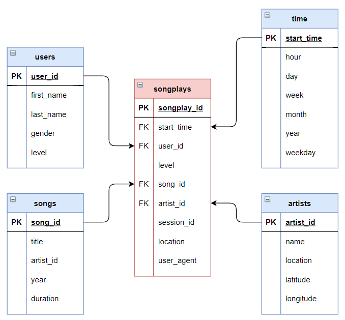
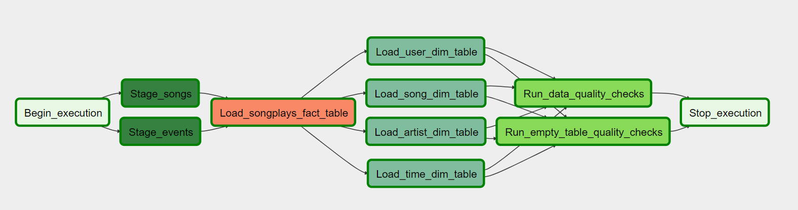

# Data engineering Nanodegree

I am super thrilled to have complete the [Data Engineering Nanodegree on Udacity](https://www.udacity.com/course/data-engineer-nanodegree--nd027). In this repo, you can find all the units' projects I coded and worked on.

**Technologies, libraries and frameworks I used:**
-  Python, Jupyter Notebook
-  Pandas
-  SQL
-  PostgreSQL
-  Apache Cassandra
-  Apache Spark
-  Apache Airflow
-  Amazon Web Service (AWS):
	-   S3
	-   Redshift
	-  Setup of Credentials, Roles & Users
	-  Budget monitoring 

# Projects

The data engineering program touches the following topics: **1)** data modelling, **2)** data warehouse, **3)** data lake and **4)** data pipeline. Each unit has its own project based on problem from a fictive company named Sparkify. 

## Fictive company: Sparkify

**Sparkify** is a fictive company with a music streaming mobile application (like spotify)

**Initial data** collected by Sparkify are stored directly in S3. Their data comes into two types of JSON files:

1. *log_data* : The user activity on the app contains data specific to each user and his associated activities (page he's on, songs he's listening to and when he's listening to it, premium or free user, etc.)

2.  *song_data* : Metadata on the songs in the app contains information about songs own by Sparkify (song's name, artist, album, etc.)

## Project 1: [Data Modeling with PostgreSQL](https://github.com/Rammen/DataEngineering_Course/tree/main/DataModeling_PostgreSQL)

**Skills**: Apache Cassandra, Jupyter, Python, SQL

**Sparkify Problem that needed to be tackle:** Sparkify wants to analyze the data they've been collecting on songs and user activity on their new music streaming app. Currently, they don't have an easy way to query their data. They'd like a data engineer to create a Postgres database with tables designed to optimize queries on song play analysis. 

**Task:** Create a Postgre database, a star-schema and an ETL pipeline that make analyses easier. 

**Project:**
1. Explore and understand the raw data with Pandas
2. Define fact and dimension tables for a star schema
3. Write an ETL pipeline that transfers data from files in two local directories into these tables in Postgres using Python and SQL.

## Project 2: [Data Modeling with Apache Cassandra](https://github.com/Rammen/DataEngineering_Course/tree/main/DataModeling_ApacheCassandra)

**Skills**: Apache Cassandra, Python, Jupyer

**Sparkify Problem that needed to be tackle:** Sparkify wants to analyze the data they've been collecting on songs and user activity on their new music streaming app. Currently, they don't have an easy way to query their data. They'd like a data engineer to create a Apache Cassandra database to optimize their analyses. 

**Task:** Create a non-relational database and an ETL pipeline that make analyses easier. 

**Project:**
1. Denormalization of the raw data
2. Create an Apache Cassandra database
3. Load data into tables and verify the quality by running queries

## Project 3: [Cloud Data Warehouses with AWS](https://github.com/Rammen/DataEngineering_Course/tree/main/DataWarehouse_S3_Redshift)

**Skills**: AmazonWebServices (S3, Redshift), Python, SQL

**Sparkify Problem that needed to be tackle:** Sparkify has grown their user base and song database and want to move their processes and data onto the cloud. 

**Task:**  Building an ETL pipeline that extracts Sparkify's data from S3, stages them in Redshift, and transforms data into a set of dimensional tables for their analytics team

**Project:**
1. Setup all the required credentials, roles and permission in AWS
2. Get data from S3 and add them into staging tables in redshift
3. Transform the raw data into a star-schema from *Project 1* with SQL
4. Add the new tables in Redshift

## Project 4: [Data Lake with Apache Spark](https://github.com/Rammen/DataEngineering_Course/tree/main/DataLake_Spark)

**Skills**: AmazonWebServices (S3), Apache Spark, Python

**Sparkify Problem that needed to be tackle:** Sparkify has grown their user base and song database even more and want to move their data warehouse to a data lake.

**Task:**  Build an ETL pipeline for a data lake hosted on S3

**Project:**
1. Setup all the required credentials, roles and permission in AWS
2. Get data from S3
3. Transform the raw data into a star-schema from *Project 1* with Spark
4. Add the new tables in S3

## Project 5: [Data Lake](https://github.com/Rammen/DataEngineering_Course/tree/main/DataLake_Spark)

**Skills**: AmazonWebServices (S3), Apache Airflow

**Sparkify Problem that needed to be tackle:** Sparkify decided that it is time to introduce more automation and monitoring to their data warehouse ETL pipelines. 

**Task:**  Build data pipelines that are dynamic, can be monitored, and allow easy backfills. Ensure data quality by implementing tests against the datasets to catch any discrepancies.

**Project:**
1. Setup all the required credentials, roles and permission in AWS and hooks for Airflow
2. Create empty tables in Redshift
3. Create custom operators for the DAG:
	-	Operator that load raw data from S3 into empty staging table in Redshift
	-	Operator that tranform the staging data into the star schema from *Project 1* and add them to new tables in Redshift
	-	Operator that check the quality of the data (look out for empty tables and test custom SQL queries)
4.  Organize all oprator into a pipeline with dependancies 

